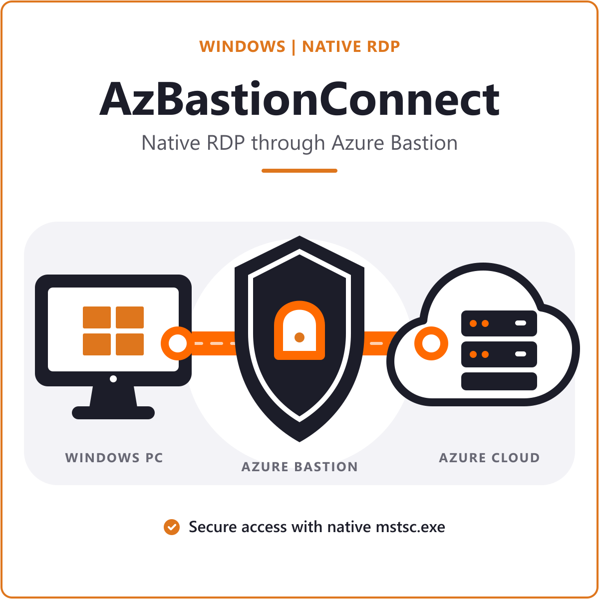
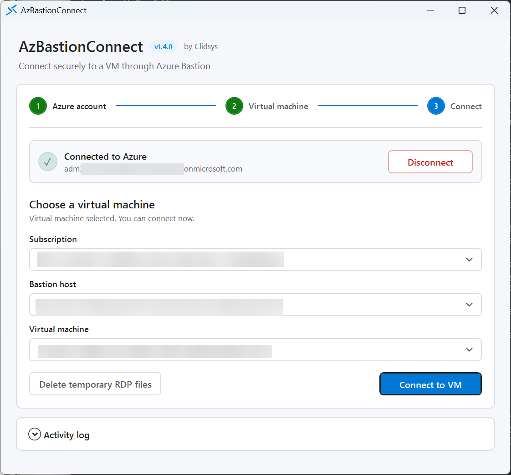

<p align="center">
  
</p>

# AzBastionConnect

Easily connect to your Azure VMs through Azure Bastion, from a WPF graphical interface or in console mode. AzBastionConnect opens the session in the standard Windows Remote Desktop client (`mstsc.exe`) instead of a browser, giving you the familiar native RDP experience, including clipboard copy and paste when allowed by the VM configuration and your organization's security policies.

> [!IMPORTANT]
> **AzBastionConnect currently supports Windows only.**
> Both the graphical interface and console mode use the native Windows RDP client. macOS and Linux are not supported.

## Prerequisites

### On your Windows machine

- Windows 10, Windows 11, or Windows Server with WPF support.
- Windows PowerShell 5.1 or PowerShell 7.
- [Azure CLI](https://learn.microsoft.com/en-us/cli/azure/install-azure-cli-windows).
- The Azure CLI `bastion` extension.
- Microsoft Remote Desktop Connection (`mstsc.exe`), included with Windows.

### In Azure

- An Azure Bastion host using the Standard SKU or higher.
- [Native Client Support](https://learn.microsoft.com/en-us/azure/bastion/native-client) enabled on the Bastion host.
- Permission to read the subscription, Bastion host, and target VM.
- Valid credentials for the target VM.

AzBastionConnect relies entirely on the Azure CLI. It does not require the PowerShell `Az`, `AzureRM`, or any other Azure PowerShell module. You also do not need to sign in beforehand because the tool runs `az login` when required.

## Install missing prerequisites

Run the following checks from PowerShell:

```powershell
# Check Azure CLI
az version

# Check the Bastion extension
az extension show --name bastion
```

Install any missing components:

```powershell
# Azure CLI
winget install --exact --id Microsoft.AzureCLI

# Azure CLI Bastion extension
az extension add --name bastion
```

If the `bastion` extension is already installed, update it with:

```powershell
az extension update --name bastion
```

In the Azure portal, verify that **Native Client Support** is enabled on the Bastion host before using the tool.

## Usage

From the repository directory, run:

```powershell
Import-Module .\Invoke-AzureBastionConnect.ps1 -Force
Invoke-AzureBastionConnect
```

The graphical interface opens on a three-step header: **Azure account**, **Virtual machine**, **Connect**. The steps turn green as you go, so you always see what is left to do.



- **Azure account**: shows the signed-in account and a **Disconnect** button. If no session exists, the tool runs `az login` for you.
- **Subscription**, **Bastion host**, **Virtual machine**: three dropdowns filled from your own permissions. Picking a Bastion host filters the virtual machines it can reach.
- **Connect to VM**: downloads the `.rdp` file if needed and opens `mstsc.exe` on the machine.
- **Delete temporary RDP files**: clears the `.rdp` files left in the temp folder by previous sessions.
- **Activity log**: unfold it to follow what the tool is doing, and to read the Azure CLI errors when a connection fails.

### Console mode

For use without the graphical interface. Select the Bastion host and virtual machine with the Up and Down arrows, press Enter to confirm, or press Escape to cancel. After selecting the Bastion host, all virtual machines are shown by default. Start typing to search by VM name or resource group, use Backspace to edit the search, or Delete to clear it:

```powershell
Invoke-AzureBastionConnect -Console
```

## How it works

1. Checks for the Azure CLI and the `bastion` extension.
2. Handles the Azure sign-in (`az login`) if needed.
3. Lets you select the subscription, the Bastion, then the target VM.
4. Reuses a recent `.rdp` file (less than one hour old) if one exists, otherwise downloads a new one via `az network bastion rdp`.
5. A button lets you clean up recent `.rdp` files from the temp folder.

## Disclaimer

AzBastionConnect is an independent tool and is **not affiliated with, endorsed by, or sponsored by Microsoft**. Azure and Azure Bastion are trademarks of Microsoft Corporation, used here for descriptive purposes only.

---

by [Clidsys](https://clidsys.com)
